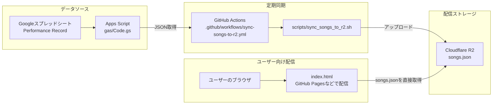

# uni-uta-db

公開ページ: https://<your-github-user>.github.io/uni-uta-db/

'**Cloudflare R2 + Static Assets** 構成です。  
このリポジトリでは、`Performance Record` シートをGASでJSON化し、GitHub ActionsでR2へ定期同期する運用を想定しています。

## 構成

- `gas/Code.gs`: スプレッドシートを `songs.json` 形式で返すGASコード
- `.github/workflows/sync-songs-to-r2.yml`: GAS -> R2 定期同期
- `scripts/sync_songs_to_r2.sh`: 同期用スクリプト
- `index.html`: 楽曲検索UI

---

## Worker について

このリポジトリの実運用は **Worker非依存（R2直接参照）** です。

- `index.html` は R2 の `songs.json` を直接 `fetch` します。
- データ更新は GitHub Actions（GAS → R2）で完結します。

そのため、Worker エントリ（`wrangler.toml` / `src/worker.js`）は運用上必須ではありません。

---

## 全体構成図



- **通常経路**: `スプレッドシート → GAS → GitHub Actions → R2 → index.html(ブラウザ)`

---

## 1. GAS（スプレッドシート読み出し）

対象シート名: `Performance Record`

列は以下を前提にしています。

- A: アーティスト名
- B: 曲名
- C: 備考（歌ってみた/ショート情報 + URL可）
- D: 歌枠直リンク（タイトル + URL、または8桁日付のみ）
- E: 出典元情報
- F: 掲載チェック

`掲載チェック` が有効（✅ / ☑ / TRUE / 1 など）の行だけを出力します。

### GASデプロイ手順

1. スプレッドシートで Apps Script を開く
2. `gas/Code.gs` の内容を貼り付け
3. デプロイ > 新しいデプロイ > ウェブアプリ
   - 実行ユーザー: 自分
   - アクセス権: リンクを知っている全員
4. 発行されたURLに `?api=songs` をつけて確認

例:

```text
https://script.google.com/macros/s/AKfycbzU9lD1qRGocSkZvZJmh6FTw75XBnLMXgRIAyEDBuwqIG_whykcxbjjrhuk6K789ciS/exec?api=songs
```

---

## 2. GitHub Actions（GAS -> R2 同期）

ワークフロー: `.github/workflows/sync-songs-to-r2.yml`

- 手動実行: `workflow_dispatch`
- 定期実行: 毎日 JST 12:00（UTC 03:00）
- 注記: GitHub Actions の cron は UTC 表記です。

### 必要な GitHub Secrets

- `GAS_SONGS_API_URL`（未設定時は以下のURLを使用）
  - `https://script.google.com/macros/s/AKfycbzU9lD1qRGocSkZvZJmh6FTw75XBnLMXgRIAyEDBuwqIG_whykcxbjjrhuk6K789ciS/exec?api=songs`
- `R2_ACCOUNT_ID`
- `R2_ACCESS_KEY_ID`
- `R2_SECRET_ACCESS_KEY`
- `R2_BUCKET`
- `R2_OBJECT_KEY`（通常 `songs.json`）


### R2アップロード/読み取りを個別検証する（切り分け用）

`sync` ワークフローとは別に、アップロード可否と読み取り可否を分けて確認したい場合は次を実行します。

```bash
chmod +x scripts/verify_r2_upload_and_read.sh
R2_ENDPOINT_URL="https://<ACCOUNT_ID>.r2.cloudflarestorage.com" \
R2_BUCKET="<bucket>" \
R2_OBJECT_KEY="songs.json" \
AWS_ACCESS_KEY_ID="<access_key>" \
AWS_SECRET_ACCESS_KEY="<secret_key>" \
bash scripts/verify_r2_upload_and_read.sh
```

このスクリプトは以下を順に検証します。

1. GASレスポンスがJSONとして妥当か（`.items` 配列を持つか）
2. R2へアップロードできるか（検証用キーへ保存）
3. R2から同じオブジェクトを読み戻せるか（S3 API経由）
4. （廃止）`WORKER_BASE_URL` を使ったWorker読み取り検証

検証で作成したオブジェクト（`*.verify.<timestamp>.json`）は、終了時に自動削除されます（失敗時も削除を試行）。
削除に失敗した場合は warning のみ表示し、検証本体の成功/失敗結果はそのまま維持されます。

※ `WORKER_BASE_URL` を使った検証は廃止済みです。指定しなければ通常のR2検証のみ実行されます。

### トラブルシュート（Workflow失敗時）

- `Missing credentials` エラー
  - `R2_ACCESS_KEY_ID` / `R2_SECRET_ACCESS_KEY`（または `AWS_ACCESS_KEY_ID` / `AWS_SECRET_ACCESS_KEY`）を設定。
- `Missing required R2 config` エラー
  - `R2_ACCOUNT_ID`, `R2_BUCKET`, `R2_OBJECT_KEY` を設定。
- `jq: parse error: Invalid numeric literal` エラー
  - JSONの数値フォーマット不正だけでなく、**GASがHTMLエラーページを返している**場合にも起こります。
  - まず `GAS_SONGS_API_URL` をブラウザで開き、`{` から始まるJSONが返るかを確認してください（`?api=songs` を必ず付与）。
  - 追加で、`scripts/sync_songs_to_r2.sh` は `Content-Type` も検証します。`text/html` が返る場合はGAS公開設定（アクセス権）またはURL誤りを疑ってください。

---

## リポジトリ譲渡（移設）時のチェックリスト

このアプリは、設定値をSecrets / `index.html` に分離しているため、譲渡時は次だけ差し替えれば継続開発できます。

1. GitHubでリポジトリを移設/rename
   - 例: `uni-uta-db`
2. GitHub Secretsを新しいリポジトリへ再設定
   - `R2_ACCOUNT_ID`, `R2_ACCESS_KEY_ID`, `R2_SECRET_ACCESS_KEY`, `R2_BUCKET`, `R2_OBJECT_KEY`, `GAS_SONGS_API_URL`
3. `index.html` の `meta[name="songs-r2-json-url"]` を新しいR2公開URLへ変更
4. Actionsの手動実行（`workflow_dispatch`）で `songs.json` 同期を確認
5. GitHub Pages URLで表示・検索・コピーの動作確認

> GitHub上の譲渡自体は、対象リポジトリの **Settings > General > Transfer ownership** から実施できます。
> 移設先アカウントに権限がある状態で、上記チェックリストを順に実施するとスムーズです。

- フロントで `サーバー: エラー:HTTP 404` が出る
  - `index.html` の `meta[name="songs-r2-json-url"]` に、R2公開URL（例: `https://pub-xxxxxxxxxxxxxxxxxxxxxxxxxxxxxxxx.r2.dev/songs.json`）を設定してください。
  - もしくはブラウザで `localStorage.setItem("songs_r2_json_url", "https://pub-xxxxxxxxxxxxxxxxxxxxxxxxxxxxxxxx.r2.dev/songs.json")` を実行して再読込してください。
  - 複数候補を持たせる場合は `meta[name="songs-r2-fallbacks"]` にカンマ区切りでURLを設定できます。
  - CORSで失敗する場合は、R2側の公開/CORS設定を見直してください。

- エラーログに `{ "errorName": "Error", "statusCode": "404", "statusDescription": "通信エラー" }` が出る
  - フロントは候補URLを順に試し、**すべて404のとき**この表示になります（`songs-r2-json-url` → `songs-r2-fallbacks` の順）。
  - まずブラウザで `https://pub-...r2.dev/songs.json` を直接開き、404にならないか確認してください。
  - 404の場合は、`R2_BUCKET` / `R2_OBJECT_KEY`（通常 `songs.json`）にアップロードされているか、Actionsの最新実行が成功しているかを確認してください。
  - GitHub Pages運用では、まず `meta[name="songs-r2-json-url"]` に有効なR2公開URLを設定してください。

---

## 3. R2に保存するJSONスキーマ

```json
{
  "items": [
    {
      "title": "曲名",
      "artist": "アーティスト名",
      "kind": "live",
      "memo": "備考",
      "singingTag": "備考",
      "liveLink": "https://...",
      "liveTitle": "配信タイトル",
      "lastSungDate": "2025-01-20",
      "publishedAt": "2025-01-20"
    }
  ],
  "total": 1,
  "generatedAt": "2026-01-01T00:00:00.000Z",
  "schemaVersion": 1
}
```

補足:
- `lastSungDate`: 歌枠直リンクの先頭8桁 (`yyyymmdd`) から生成
- `publishedAt`: ソート・表示の基準日（`lastSungDate` と同じ日付を格納）

---

## 4. 動作確認

- フロント: `index.html` からR2公開URLの `songs.json` を直接取得

フロントは `songs.json` が「配列形式」「{ items: [] } 形式」の両方を受け取れます。
